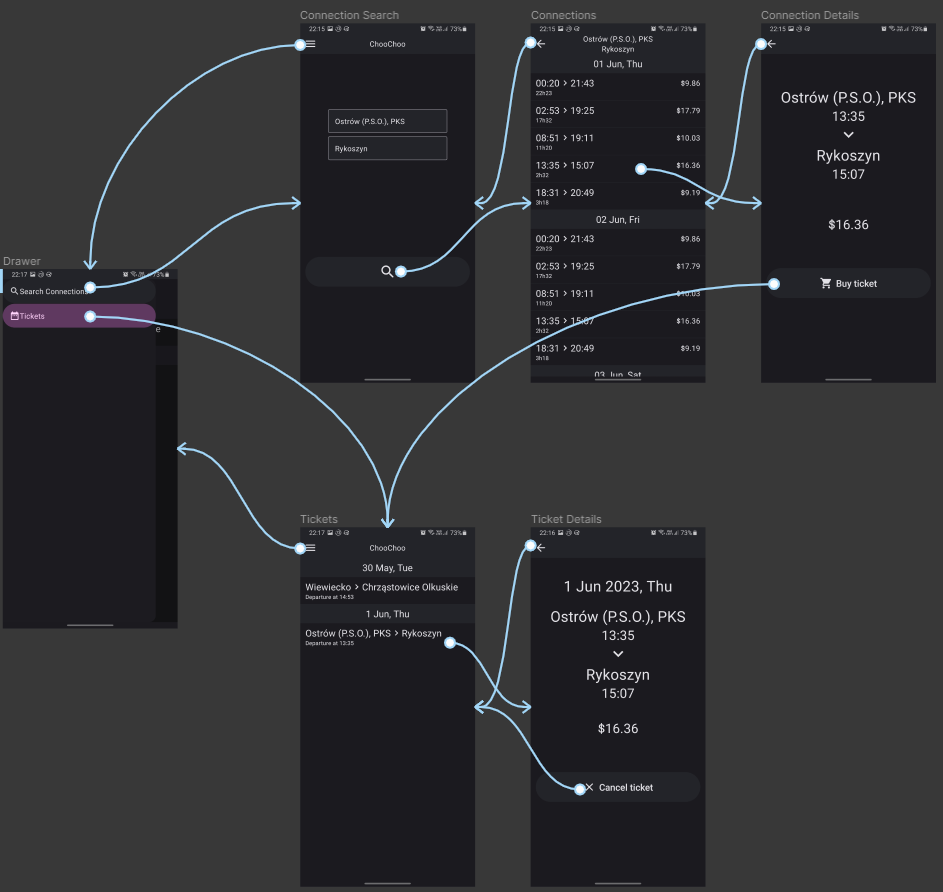

# ChooChoo

## Introduction

An application in which you can buy fake train tickets

## Main Features

* Automatically generated connections

    * When you first launch the application, the database is prepopulated with 93 stations

    * Every time you select a combination of stations that wasn't selected before, the application generates between 2 - 6 random connections that you can buy a ticket for

* Notifications

    * Buying and cancelling a ticket sends a notification

    * Notification generated by buying a ticket has an action button to cancel that ticket

    * Buying a ticket additionally creates a delayed notification, which for the purpose of the project is set to a 5 second delay

        * There is no implemented mechanism to control the notification after it is created, so contrary to expected behavior, canceling the ticket will not cancel the delayed notification

## Connections between different application screens

